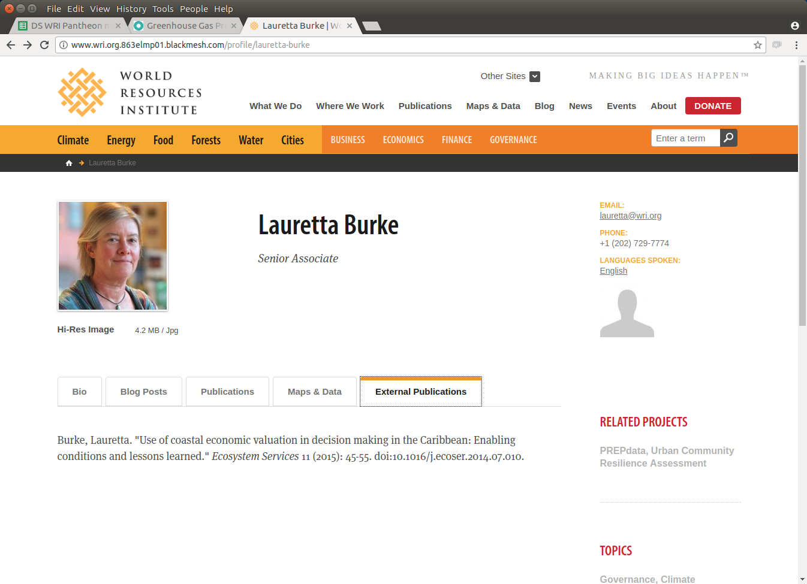

Drupal 7 module. For wri.org. Pulls a list of external publications from a json file and lists them on the author page in a tab.

##Configuration

On wri.org, use Context to add the generated block to the People pages. Add the "pane--tab" class to the CSS settings. Clear cache.

Troubleshooting: the content outputs to all People pages (even ones with no matching "external publications"). For People pages with no match, "display: none" hides the empty block. You can either look at the page source to see if the block appears, or change "forceMatchMessage" to "true" in the module file: this will output a default string regardless of an author match. 

